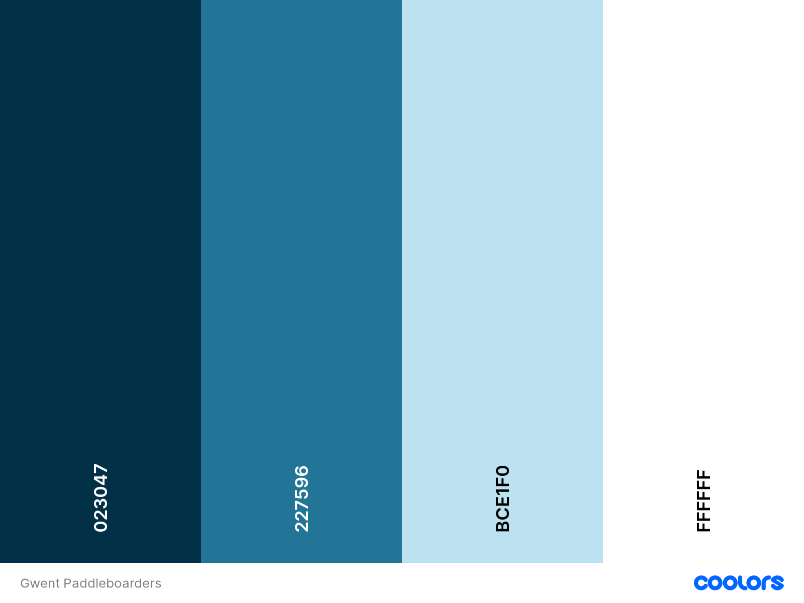
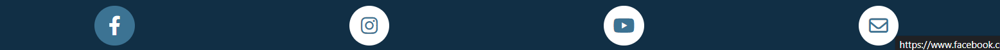
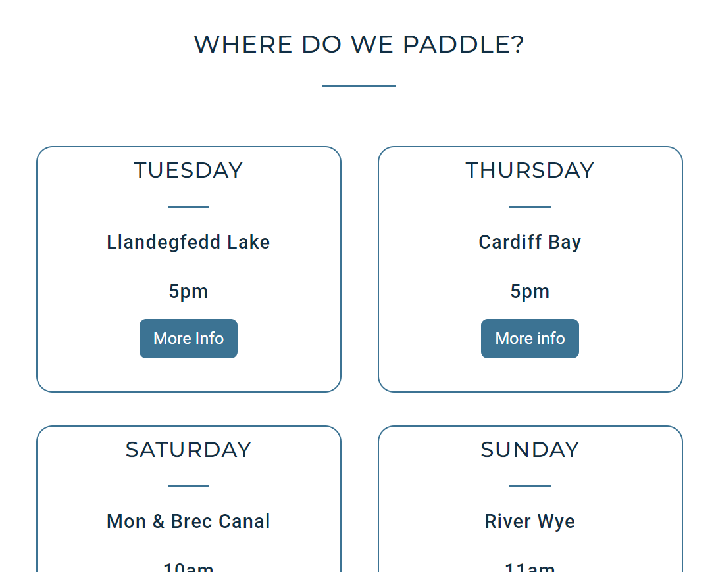
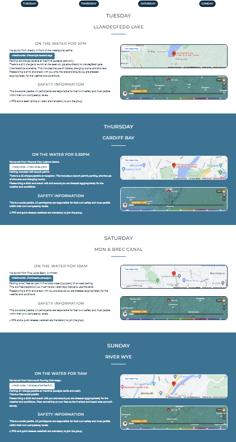

# GWENT PADDLEBOARDERS

### Milestone Project 1 - User-Centric Frontend Development

The project is a website for a social group of paddleboarders based in South Wales. The group originally started as a Facebook group, but has rapidly grown to over 1400 members and as a result the important information about paddleboarding meet-ups is becoming lost in the general chat on the page. 

The site provides some basic information about the group but the main focus is to provide information about the meet-ups which take place each week. It also shows some photographs from previous social paddles and has a contact page should a user wish to get in touch.

The website is designed to be fully responsive, allowing visitors to view it on a wide range of devices.


I used [https://ui.dev/amiresponsive](https://ui.dev/amiresponsive?url=https://laurabolwell.github.io/gwent-paddleboarders) to create this image.

[View Gwent Paddleboarders on Github Pages](https://laurabolwell.github.io/gwent-paddleboarders)


## UX

The end user of this project are paddleboarders in South Wales who wish to paddle with the group. The users range in age from 18 to 60 and the site would mainly be accessed on mobile devices. 

The end user wants to be able to find out details of social paddles taking place and how to join one. 
Other features are that the user will be able to see photographs of recent paddles, see maps and current weather conditions at paddle locations, get in touch with the organisers, and easily navigate to the group's social media pages.

### Colour Scheme



The website uses a palette of blues to tie in with the water theme and to give a sense of calm. I used [coolors.co](https://coolors.co/023047-227596-bce1f0-ffffff) to generate my colour palette.

- \#023047 used as the background for the navbar and footer, and used for text, headings, and buttons.
- \#227596 used as a background for sections of the page, for block dividing lines, and for buttons.
- \#BCE1F0 used for hover effects.
- \#FFFFFF used as a background for sections of the page, block dividing lines, and for text on non-white backgrounds.

I've used CSS `:root` variables to easily update the global colour scheme by changing only one value, instead of everywhere in the CSS file.

```css
:root {
    --navy: #023047;
    --mid-blue: #227596;
    --light-blue: #BCE1F0;
    --white: #FFF;
}
```

### Typography

Google Fonts:
* [Montserrat](https://fonts.google.com/specimen/Montserrat) was used for headings and the navbar.
* [Roboto](https://fonts.google.com/specimen/Roboto) was used for the body text.

[Font Awesome](www.fontawesome.com) icons were used throughout the site, such as the social media icons in the footer.


## User Stories

### New Site Users

- As a new site user, I would like to find out what the group is about, so that I can see if it would be suitable for me to join.
- As a new site user, I would like to view photos of previous paddles, so that I can get a feel for if the group would be suitable for me.
- As a new site user, I would like to find out where and when the group meets, so that I can join the group.
- As a new site user, I would like to find out how to join a group paddle and if there is any cost, so that I can join the group.
- As a new site user, I would like to find out about parking at paddle locations, so that I will know where to park my car when I join the group.
- As a new site user, I would like to contact the group organisers, so that I can ask any other questions I may have.

### Returning Site Users

- As a returning site user, I would like to find the schedule, so that I can check the times of group paddles.
- As a returning site user, I would like to check the weather conditions at paddle spots, so that I can decide whether to join a particular paddle.
- As a returning site user, I would like to view photogaphs of social paddles, so that I can show family and friends.
- As a returning site user, I would like to contact the group organisers, so that I can suggest new paddle locations.
- As a returning site user, I would like to easily find the group's social media pages, so that I can connect with other paddlers in the group.

### Site Admin

- As a site administrator, I should be able to have all paddle information displayed, so that I can update all members and potential members on locations, times and other details eg parking costs.
- As a site administrator, I should be able to have images on the site, so that existing members can see photos of themselves from previous paddles and new members can see what our paddles are about.
- As a site administrator, I should be able to be contacted by both new and existing members, so that I can listen to any suggestions or answer any queries they may have.

## Wireframes

⚠️⚠️⚠️⚠️⚠️ START OF NOTES (to be deleted) ⚠️⚠️⚠️⚠️⚠️

In this section, display your wireframe screenshots using a Markdown `table`.

Instructions on how to do Markdown `tables` start on line #213 on this site: https://pandao.github.io/editor.md/en.html

🛑🛑🛑🛑🛑 END OF NOTES (to be deleted) 🛑🛑🛑🛑🛑

To follow best practice, wireframes were developed for mobile, tablet, and desktop sizes.
I've used [Balsamiq](https://balsamiq.com/wireframes) to design my site wireframes.

### Home Page Wireframes

| Size | Screenshot |
| --- | --- |
| Mobile |  |
| Tablet |  |
| Desktop |  |

### About Page Wireframes

| Size | Screenshot |
| --- | --- |
| Mobile |  |
| Tablet |  |
| Desktop |  |

### Contact Page Wireframes

| Size | Screenshot |
| --- | --- |
| Mobile |  |
| Tablet |  |
| Desktop |  |

⚠️⚠️⚠️⚠️⚠️ START OF NOTES (to be deleted) ⚠️⚠️⚠️⚠️⚠️

Repeat for any addition wireframe pages you have.

🛑🛑🛑🛑🛑 END OF NOTES (to be deleted) 🛑🛑🛑🛑🛑

## Features

⚠️⚠️⚠️⚠️⚠️ START OF NOTES (to be deleted) ⚠️⚠️⚠️⚠️⚠️

In this section, you should go over the different parts of your project,
and describe each in a sentence or so.

You will need to explain what value each of the features provides for the user,
focusing on who this website is for, what it is that they want to achieve,
and how your project is the best way to help them achieve these things.

For some/all of your features, you may choose to reference the specific project files that implement them.

IMPORTANT: Remember to always include a screenshot of each individual feature!

🛑🛑🛑🛑🛑 END OF NOTES (to be deleted) 🛑🛑🛑🛑🛑

The website is comprised of six pages, four of which are accessible from the navigation menu (Home, Schedule, Gallery and Contact pages). The fifth page is a confirmation page which is shown when the user submits the form on the contact page, and the sixth is a 404 error page which is shown if a user tries to navigate to an incorrect address within the site. 

### Existing Features

#### All Pages on the website have: 

- **Navbar**

    - A responsive navigation bar displayed clearly at the top of the page which allows the user to navigate around the site. On the left of the navbar is the name of the club and on the right of the navbar are the links to the website pages: Home, Schedule, Gallery, and Contact.
    - The nav links are shown in white text while the current active page is shown in a light-blue, this gives the user feedback as to their current position on the site while still providing a good contrast against the navy navbar background colour. 
    - Hover effects (larger size and changed color) on navbar-brand and the navbar links give instant feedback to the user.

    Navbar with active Home page:
    
    Navbar with active home page and hover on Schedule page:
    

- **Navbar Mobile Toggler**

    - On screen sizes less than 768px, the navbar collapses to a burger toggler. This was implemented to give the site a clean look and prevent the navbar from becoming too cluttered. Both the burger icon and dropdown menu are on the right side of the screen, this provides a good user experience as most users would use their right thumb to click on the icon and then the dropdown menu appears in close proximity to it.
    - On screen sizes less than 420px, a line break appears between 'Gwent' and 'Paddleboarders' to prevent the burger icon from overflowing onto the next line.

    Collapsed navbar:
    
    Collapsed navbar on screens less than 420px:
    
    Collapsed navbar with menu open:
    
    Collapsed navbar with menu open on screens less than 420px:
    

- **Footer**

    - The footer contains links to the Facebook, Instagram, and YouTube sites of the group. It also has a link to the Contact page. Universally recognisable icons were used rather than text to the give the footer a clean look. The icons change color when hovered over to give instant feedback to the user. The three external social media links open in a new page while the Contact page link opens in the current window.

    Footer:
    
    Footer with hover effect on Facebook icon:
    

#### Home Page

- **Hero Image with chevron icon**

    - The landing page shows a large image of 2 paddleboarders that covers the full viewport height which gives a clean look to the page. There is a clearly visible chevron icon at the bottom of the screen alerting users that there is further content below this image. Users can either scroll down or click on the icon to reach the next section.

    Homepage Hero Image:
    

- **'About Section**

    - The section gives some information about the group that new users would need to know before joining a paddle. It also lets potential members know that the group does not offer tuition or hire and is not suitable for beginners.

    About Section:
    

- **Benefits Section**

    - This section gives the users some information of benefits of paddleboarding in general and also benefits of paddleboarding in a group.
    - On large screens the three subsections are displayed in a row, on medium screens two sections are displayed next two each other with the third below, and on small screens the sections are stacked vertically.

    Benefits (small screen):
    
    Benefits (medium screen):
    
    Benefits (large screen):
    

- **Schedule Overview**

    - This section provides a brief overview of the schedule of social paddles taking place each week. There are four cards (one for each of the four paddles) with each showing the day, location and time.
    - Each card has a button linking to the Schedule page which shows the full information for the paddle. The buttons are large and have a colour-changing hover effect.
    - On large screens the four cards are displayed in a row, on medium screens they are displayed in two rows of two, and on small screens they are stacked vertically.

    Schedule overview (small screen):
    
    Schedule overview (medium screen):
    
    Schedule overview (large screen):
    

#### Schedule Page

- **Links to jump to each section of the page**

    - Across the top of the page just below the navbar there are four buttons which link to each of the four sections of the schedule page. This allows the user to jump straight to the information for the day they are looking for, minimising the amount of scrolling needed. Each button has a hover effect which is visible against both the white and blue background sections of the schedule page.
    - The buttons are displayed in two rows of two on mobile devices and in one row on all other devices.
    - The buttons stick to the top of the page when scrolling to enable easier navigation around the page.

    Link buttons:
    
    Link buttons with hover effect shown on Thursday:
    

- **Paddle Information Sections**

    - The schedule page has four distinct sections, one for each of the four planned social paddles that take place each week. Each section has some text giving the user vital information about the paddle as well as parking information and any fees that may apply. It also has a safety disclaimer.
    - Within the text there is a button linking to the what3words meeting location. This opens in a new window, or in the what3words app if it is downloaded on the device.
    - For each section on the page there is a embedded google map showing the meeting location.    
    - For each section on the page there is a widget showing current wind conditions and how they will change over the next week. This will enable users to see at a glance if the conditions are good enough for them to attend the paddle.
    - On large screens the text and map/conditions appear side by side but on small screens they are stacked vertically.
    
    Zoomed out view showing the four sections:
    
    Single section showing the text, what3words link, Google Map, and Windy.com conditions widget:
    

#### Gallery Page

- **Carousel Sections**

    - The gallery page has four distinct sections, one for each of the paddle locations, and each section contains a carousel of images from paddles at that location.
    - The carousels cycle through the images automatically but also contain controls for users to manually move forward or backwards through the images if they wish to. 
    -The carousels will give new users a feel for if the group would be suitable for them and will give existing members a chance to see photos of them participating in paddles.

    Carousels for two of the four sections:
    
    

#### Contact Page

- **Contact Form**

    - The form contains fields for the users' name, email address, phone number and a message.
    - The name, email address and message fields must be filled in order to submit the form. If any of this information is missing (or the email address is in an incorrect format), the user will be guided to fill in what they have missed.
    - The phone number is an optional field. If a user wishes to enter their phone number, it must be entered in the correct format, which the placeholder text describes for the user.


- **Title for feature #3**

    - Details about this particular feature, including the value to the site, and benefit for the user. Be as detailed as possible!


- **Title for feature #3**

    - Details about this particular feature, including the value to the site, and benefit for the user. Be as detailed as possible!


- **Title for feature #3**

    - Details about this particular feature, including the value to the site, and benefit for the user. Be as detailed as possible!


- **Title for feature #3**

    - Details about this particular feature, including the value to the site, and benefit for the user. Be as detailed as possible!


⚠️⚠️⚠️⚠️⚠️ START OF NOTES (to be deleted) ⚠️⚠️⚠️⚠️⚠️

Repeat as necessary for as many features as your site contains.

Hint: the more, the merrier!

🛑🛑🛑🛑🛑 END OF NOTES (to be deleted) 🛑🛑🛑🛑🛑

### Future Features

⚠️⚠️⚠️⚠️⚠️ START OF NOTES (to be deleted) ⚠️⚠️⚠️⚠️⚠️

Do you have additional ideas that you'd like to include on your project in the future?
Fantastic! List them here!
It's always great to have plans for future improvements!
Consider adding any helpful links or notes to help remind you in the future, if you revisit the project in a couple years.

🛑🛑🛑🛑🛑 END OF NOTES (to be deleted) 🛑🛑🛑🛑🛑

- Title for future feature #1
    - Any additional notes about this feature.
- Title for future feature #2
    - Any additional notes about this feature.
- Title for future feature #3
    - Any additional notes about this feature.

## Tools & Technologies Used

⚠️⚠️⚠️⚠️⚠️ START OF NOTES (to be deleted) ⚠️⚠️⚠️⚠️⚠️

In this section, you should explain the various tools and technologies used to develop the project.
Make sure to put a link (where applicable) to the source, and explain what each was used for.
Some examples have been provided, but this is just a sample only, your project might've used others.
Feel free to delete any unused items below as necessary.

🛑🛑🛑🛑🛑 END OF NOTES (to be deleted) 🛑🛑🛑🛑🛑

- [HTML](https://en.wikipedia.org/wiki/HTML) used for the main site content.
- [CSS](https://en.wikipedia.org/wiki/CSS) used for the main site design and layout.
- [CSS :root variables](https://www.w3schools.com/css/css3_variables.asp) used for reusable styles throughout the site.
- [CSS Flexbox](https://www.w3schools.com/css/css3_flexbox.asp) used for an enhanced responsive layout.
- [CSS Grid](https://www.w3schools.com/css/css_grid.asp) used for an enhanced responsive layout.
- [JavaScript](https://www.javascript.com) used for user interaction on the site.
- [Python](https://www.python.org) used as the back-end programming language.
- [Git](https://git-scm.com) used for version control. (`git add`, `git commit`, `git push`)
- [GitHub](https://github.com) used for secure online code storage.
- [GitHub Pages](https://pages.github.com) used for hosting the deployed front-end site.
- [Gitpod](https://gitpod.io) used as a cloud-based IDE for development.
- [Bootstrap](https://getbootstrap.com) used as the front-end CSS framework for modern responsiveness and pre-built components.
- [Materialize](https://materializecss.com) used as the front-end CSS framework for modern responsiveness and pre-built components.
- [Flask](https://flask.palletsprojects.com) used as the Python framework for the site.
- [Django](https://www.djangoproject.com) used as the Python framework for the site.
- [MongoDB](https://www.mongodb.com) used as the non-relational database management with Flask.
- [SQLAlchemy](https://www.sqlalchemy.org) used as the relational database management with Flask.
- [PostgreSQL](https://www.postgresql.org) used as the relational database management.
- [ElephantSQL](https://www.elephantsql.com) used as the Postgres database.
- [Heroku](https://www.heroku.com) used for hosting the deployed back-end site.
- [Cloudinary](https://cloudinary.com) used for online static file storage.
- [Stripe](https://stripe.com) used for online secure payments of ecommerce products/services.
- [AWS S3](https://aws.amazon.com/s3) used for online static file storage.

## Testing

For all testing, please refer to the [TESTING.md](TESTING.md) file.

## Deployment

The site was deployed to GitHub Pages. The steps to deploy are as follows:
- In the [GitHub repository](https://github.com/laurabolwell/gwent-paddleboarders), navigate to the Settings tab 
- From the source section drop-down menu, select the **Main** Branch, then click "Save".
- The page will be automatically refreshed with a detailed ribbon display to indicate the successful deployment.

The live link can be found [here](https://laurabolwell.github.io/gwent-paddleboarders)

### Local Deployment

This project can be cloned or forked in order to make a local copy on your own system.

#### Cloning

You can clone the repository by following these steps:

1. Go to the [GitHub repository](https://github.com/laurabolwell/gwent-paddleboarders) 
2. Locate the Code button above the list of files and click it 
3. Select if you prefer to clone using HTTPS, SSH, or GitHub CLI and click the copy button to copy the URL to your clipboard
4. Open Git Bash or Terminal
5. Change the current working directory to the one where you want the cloned directory
6. In your IDE Terminal, type the following command to clone my repository:
	- `git clone https://github.com/laurabolwell/gwent-paddleboarders.git`
7. Press Enter to create your local clone.

Alternatively, if using Gitpod, you can click below to create your own workspace using this repository.

[](https://gitpod.io/#https://github.com/laurabolwell/gwent-paddleboarders)

Please note that in order to directly open the project in Gitpod, you need to have the browser extension installed.
A tutorial on how to do that can be found [here](https://www.gitpod.io/docs/configure/user-settings/browser-extension).

#### Forking

By forking the GitHub Repository, we make a copy of the original repository on our GitHub account to view and/or make changes without affecting the original owner's repository.
You can fork this repository by using the following steps:

1. Log in to GitHub and locate the [GitHub Repository](https://github.com/laurabolwell/gwent-paddleboarders)
2. At the top of the Repository (not top of page) just above the "Settings" Button on the menu, locate the "Fork" Button.
3. Once clicked, you should now have a copy of the original repository in your own GitHub account!

### Local VS Deployment

⚠️⚠️⚠️⚠️⚠️ START OF NOTES (to be deleted) ⚠️⚠️⚠️⚠️⚠️

Use this space to discuss any differences between the local version you've developed, and the live deployment site on GitHub Pages.

🛑🛑🛑🛑🛑 END OF NOTES (to be deleted) 🛑🛑🛑🛑🛑

## Credits

⚠️⚠️⚠️⚠️⚠️ START OF NOTES (to be deleted) ⚠️⚠️⚠️⚠️⚠️

In this section you need to reference where you got your content, media, and extra help from.
It is common practice to use code from other repositories and tutorials,
however, it is important to be very specific about these sources to avoid plagiarism.

🛑🛑🛑🛑🛑 END OF NOTES (to be deleted) 🛑🛑🛑🛑🛑

### Content

⚠️⚠️⚠️⚠️⚠️ START OF NOTES (to be deleted) ⚠️⚠️⚠️⚠️⚠️

Use this space to provide attribution links to any borrowed code snippets, elements, or resources.
A few examples have been provided below to give you some ideas.

Ideally, you should provide an actual link to every resource used, not just a generic link to the main site!

🛑🛑🛑🛑🛑 END OF NOTES (to be deleted) 🛑🛑🛑🛑🛑

| Source | Location | Notes |
| --- | --- | --- |
| [Markdown Builder](https://traveltimn.github.io/markdown-builder) | README and TESTING | tool to help generate the Markdown files |
| [Chris Beams](https://chris.beams.io/posts/git-commit) | version control | "How to Write a Git Commit Message" |
| [W3Schools](https://www.w3schools.com/howto/howto_js_topnav_responsive.asp) | entire site | responsive HTML/CSS/JS navbar |
| [W3Schools](https://www.w3schools.com/howto/howto_css_modals.asp) | contact page | interactive pop-up (modal) |
| [W3Schools](https://www.w3schools.com/css/css3_variables.asp) | entire site | how to use CSS :root variables |
| [Flexbox Froggy](https://flexboxfroggy.com/) | entire site | modern responsive layouts |
| [Grid Garden](https://cssgridgarden.com) | entire site | modern responsive layouts |
| [StackOverflow](https://stackoverflow.com/a/2450976) | quiz page | Fisher-Yates/Knuth shuffle in JS |
| [YouTube](https://www.youtube.com/watch?v=YL1F4dCUlLc) | leaderboard | using `localStorage()` in JS for high scores |
| [YouTube](https://www.youtube.com/watch?v=u51Zjlnui4Y) | PP3 terminal | tutorial for adding color to the Python terminal |
| [strftime](https://strftime.org) | CRUD functionality | helpful tool to format date/time from string |
| [WhiteNoise](http://whitenoise.evans.io) | entire site | hosting static files on Heroku temporarily |

### Media

⚠️⚠️⚠️⚠️⚠️ START OF NOTES (to be deleted) ⚠️⚠️⚠️⚠️⚠️

Use this space to provide attribution links to any images, videos, or audio files borrowed from online.
A few examples have been provided below to give you some ideas.

If you're the owner (or a close acquaintance) of all media files, then make sure to specify this.
Let the assessors know that you have explicit rights to use the media files within your project.

Ideally, you should provide an actual link to every media file used, not just a generic link to the main site!
The list below is by no means exhaustive. Within the Code Institute Slack community, you can find more "free media" links
by sending yourself the following command: `!freemedia`.

🛑🛑🛑🛑🛑 END OF NOTES (to be deleted) 🛑🛑🛑🛑🛑

| Source | Location | Type | Notes |
| --- | --- | --- | --- |
| [Pexels](https://www.pexels.com) | entire site | image | favicon on all pages |
| [Lorem Picsum](https://picsum.photos) | home page | image | hero image background |
| [Unsplash](https://unsplash.com) | product page | image | sample of fake products |
| [Pixabay](https://pixabay.com) | gallery page | image | group of photos for gallery |
| [Wallhere](https://wallhere.com) | footer | image | background wallpaper image in the footer |
| [This Person Does Not Exist](https://thispersondoesnotexist.com) | testimonials | image | headshots of fake testimonial images |
| [Audio Micro](https://www.audiomicro.com/free-sound-effects) | game page | audio | free audio files to generate the game sounds |
| [Videvo](https://www.videvo.net/) | home page | video | background video on the hero section |
| [TinyPNG](https://tinypng.com) | entire site | image | tool for image compression |

### Acknowledgements

⚠️⚠️⚠️⚠️⚠️ START OF NOTES (to be deleted) ⚠️⚠️⚠️⚠️⚠️

Use this space to provide attribution to any supports that helped, encouraged, or supported you throughout the development stages of this project.
A few examples have been provided below to give you some ideas.

🛑🛑🛑🛑🛑 END OF NOTES (to be deleted) 🛑🛑🛑🛑🛑

- I would like to thank my Code Institute mentor, [Tim Nelson](https://github.com/TravelTimN) for their support throughout the development of this project.
- I would like to thank the [Code Institute](https://codeinstitute.net) tutor team for their assistance with troubleshooting and debugging some project issues.
- I would like to thank the [Code Institute Slack community](https://code-institute-room.slack.com) for the moral support; it kept me going during periods of self doubt and imposter syndrome.
- I would like to thank my partner (John/Jane), for believing in me, and allowing me to make this transition into software development.
- I would like to thank my employer, for supporting me in my career development change towards becoming a software developer.
