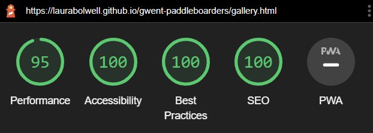
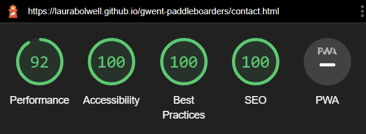
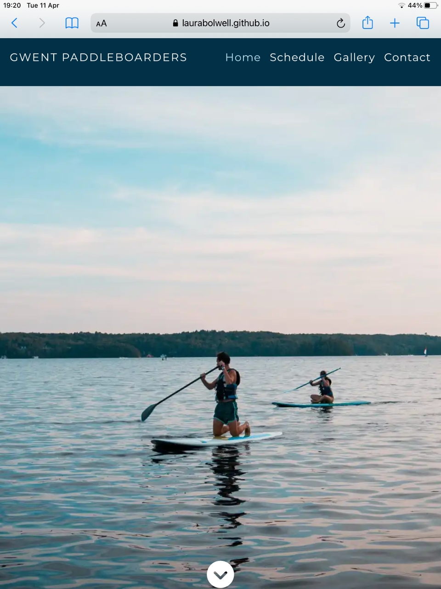

# Testing

## Code Validation

### HTML

I have used the recommended [HTML W3C Validator](https://validator.w3.org) to validate all of my HTML files.

| Page | W3C URL | Screenshot | Notes |
| --- | --- | --- | --- |
| Home | [W3C](https://validator.w3.org/nu/?doc=https%3A%2F%2Flaurabolwell.github.io%2Fgwent-paddleboarders%2F) |  | Pass: No Errors |
| Schedule | [W3C](https://validator.w3.org/nu/?doc=https%3A%2F%2Flaurabolwell.github.io%2Fgwent-paddleboarders%2Fschedule.html) |  | Pass: No Errors |
| Gallery | [W3C](https://validator.w3.org/nu/?doc=https%3A%2F%2Flaurabolwell.github.io%2Fgwent-paddleboarders%2Fgallery.html) |  | Pass: No Errors |
| Contact | [W3C](https://validator.w3.org/nu/?doc=https%3A%2F%2Flaurabolwell.github.io%2Fgwent-paddleboarders%2Fcontact.html) |  | Pass: No Errors |
| Confirmation | [W3C](https://validator.w3.org/nu/?doc=https%3A%2F%2Flaurabolwell.github.io%2Fgwent-paddleboarders%2Fconfirmation.html) |  | Pass: No Errors |
| 404 | [W3C](https://validator.w3.org/nu/?doc=https%3A%2F%2Flaurabolwell.github.io%2Fgwent-paddleboarders%2F404.html) |  | Pass: No Errors |

### CSS

I have used the recommended [CSS Jigsaw Validator](https://jigsaw.w3.org/css-validator) to validate all of my CSS files.

| File | Jigsaw URL | Screenshot | Notes |
| --- | --- | --- | --- |
| style.css | [Jigsaw](https://jigsaw.w3.org/css-validator/validator?uri=https%3A%2F%2Flaurabolwell.github.io%2Fgwent-paddleboarders%2F&profile=css3svg&usermedium=all&warning=1&vextwarning=&lang=en) |  | Pass: All errors shown are from the imported Bootstrap library |


## Browser Compatibility

I've tested my deployed project on multiple browsers to check for compatibility issues.

| Browser | Screenshot | Notes |
| --- | --- | --- |
| Chrome |  | Works as expected |
| Firefox |  | Works as expected |
| Edge |  | Works as expected |
| Brave |  | Works as expected |
| Opera |  | Works as expected |
| Internet Explorer |  | Does not work as expected |


## Responsiveness

I've tested my deployed project on multiple devices to check for responsiveness issues.

| Device | Screenshot | Notes |
| --- | --- | --- |
| XS Mobile (DevTools) |  | Works as expected |
| Small Mobile (DevTools) |  | Works as expected |
| Medium Mobile (DevTools) |  | Works as expected |
| Large Mobile (DevTools) |  | Works as expected |
| Small Tablet (DevTools) |  | Works as expected |
| Tablet (DevTools) |  | Works as expected |
| Laptop (DevTools) |  | Works as expected |
| Large Laptop (DevTools) |  | Works as expected |
| Desktop |  | Works as expected |
| XL Monitor (DevTools) |  | Scaling starts to have minor issues |
| 4K Monitor (DevTools) |  | Scaling issues |
| iphone11 |  | Works as expected |
| ipad |  | Works as expected |

## Lighthouse Audit

I've tested my deployed project using the Lighthouse Audit tool to check for any major issues. I have made the following changes to the site following lighthouse suggestions:
- Add meta description tags to head element of each page
- Add meta keywords tag to head element of home page
- Converted hero image and all gallery images to webp format
- Change text on schedule-overview buttons from 'More Info' to 'Full Details'

The following screenshots show the final lighthouse testing results. 

| Page | Size | Screenshot | Notes |
| --- | --- | --- | --- |
| Home | Mobile |  | No major issues |
| Home | Desktop |  | No major issues |
| Schedule | Mobile |  | No major issues |
| Schedule | Desktop |  | No major issues |
| Gallery | Mobile |  | No major issues |
| Gallery | Desktop |  | No major issues |
| Contact | Mobile |  | No major issues |
| Contact | Desktop |  | No major issues |
| Confirmation | Mobile |  | No major issues |
| Confirmation | Desktop |  | No major issues |
| 404 | Mobile |  | No major issues |
| 404 | Desktop |  | No major issues |


## User Story Testing

| User Story | Screenshot | |
| --- | --- | ---|
| As a new site user, I would like to find out what the group is about, so that I can see if it would be suitable for me to join. |  | |
| As a new site user, I would like to view photos of previous paddles, so that I can get a feel for if the group would be suitable for me. |  | |
| As a new site user, I would like to find out where and when the group meets, so that I can join the group. |  |  |
| As a new site user, I would like to find out how to join a group paddle and if there is any cost, so that I can join the group. |  | |
| As a new site user, I would like to find out about parking at paddle locations, so that I will know where to park my car when I join the group. |  | |
| As a new site user, I would like to contact the group organisers, so that I can ask any other questions I may have. |  | |
| As a returning site user, I would like to find the schedule, so that I can check the times of group paddles. |  | 
| As a returning site user, I would like to check the weather conditions at paddle spots, so that I can decide whether to join a particular paddle. |  | |
| As a returning site user, I would like to view photogaphs of social paddles, so that I can show family and friends. |  | |
| As a returning site user, I would like to contact the group organisers, so that I can suggest new paddle locations. |  | |
| As a returning site user, I would like to easily find the group's social media pages, so that I can connect with other paddlers in the group. |  | |
| As a site administrator, I should be able to have all paddle information displayed, so that I can update all members and potential members on locations, times and other details eg parking costs. |  | |
| As a site administrator, I should be able to have images on the site, so that existing members can see photos of themselves from previous paddles and new members can see what our paddles are about. |  | |
| As a site administrator, I should be able to be contacted by both new and existing members, so that I can listen to any suggestions or answer any queries they may have. |  | |


## Bugs and Issues

- Navbar overflow issues

    Due to the long page name I had issues with the navbar content overflowing the page width. To overcome this I set the navbar to collapse when the screen size drops below 768px. I also had the issue of the navbar toggler icon dropping below the navbar brand on devices smaller than 420px. To fix this I added a line break between 'Gwent' and 'Paddleboarders' and used a media query so that the line break would only be visible on devices less than 420px.

- Visible white gutters on blue background

    I had white gutters running down each side of the page even when using the container-fluid class. This was because I was using html section elements and then separate div elements for the bootstrap container/row/column classes. I fixed the issue by removind the unnecessary div elements and adding the appropriate bootstrap class to the section element instead.

- Hero image overflowing below viewport window

    I had set my hero image to have height 100vh, with the navbar above it, this meant that the bottom of the image (and the chevron icon) had overflowed below the viewport window. To fix this, I gave the navbar position:absolute at the top of the page which meant it now overlays the top of the hero image and the image is the right height for the screen.

- Schedule overview card buttons appearing at different heights

    At 1075-1080px, two of the location headings wrap onto a second line, causing the 'Full Details' buttons to sit at different heights. I have fixed this by adding a fixed-height-heading class to all four of these headings and allowing enough room that the text can overflow onto a second line. The buttons are now aligned on all viewport sizes.

    Buttons not aligned:\
    \
    Issue fixed:\
    

- Footer not sitting at the bottom of the page on contact, confirmation and 404 pages

    On some screen sizes the page content does not fill the full viewport height and the footer was above the bottom of the screen with white space below. I tried to fix this by fixing the footer to the bottom of the screen but this created the problem that the footer was now over the content on some other screen sizes. My mentor suggested adding the following code to my CSS which has now fixed the issue.
    ```
    html, body {
        height: 100%;
    }

    body > footer {
        : sticky;
        top: 100vh;
    }
    ```

## Unfixed Bugs

- Hero image not displaying correctly on apple devices

    The background-attachment:fixed property is causing the hero image to display incorrectly on small apple devices, ie, iphones and ipads. This is because iOS has an issue preventing background-attachment: fixed from being used with background-size: cover. This issue is documented [here](https://caniuse.com/background-attachment), and this site also suggests there will be issues with it on android browsers (unfortunately I don't have any android devices to manually test).

    Incorrectly displayed hero image (iphone11):\
    \
    Incorrectly displayed hero image (ipad):\
    

    In order to try to overcome this I have removed the background-attachment: fixed property and added it as a media query so that the image will only be fixed on screen sizes larger than 992px. The image now scrolls with the page on mobile and tablet screen sizes which does not look as good as when it is fixed but at least the image displays correctly, and will also fix any potential display issues on android devices as well as the known issues on iOS.

    Correctly displayed hero image (iphone11):\
    \
    Correctly displayed hero image (ipad):\
    

    I am unsure of whether the fixed property causes the hero image to display incorrectly on safari on macOS as I do not have any suitable devices to manually test.

    
Return back to the [README.md](README.md) file.