# Testing

Return back to the [README.md](README.md) file.

## Code Validation

### HTML

I have used the recommended [HTML W3C Validator](https://validator.w3.org) to validate all of my HTML files.

| Page | W3C URL | Screenshot | Notes |
| --- | --- | --- | --- |
| Home | [W3C](https://validator.w3.org/nu/?doc=https%3A%2F%2Flaurabolwell.github.io%2Fgwent-paddleboarders%2F) | 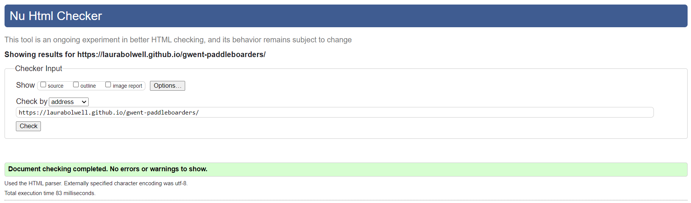 | Pass: No Errors |
| Schedule | [W3C](https://validator.w3.org/nu/?doc=https%3A%2F%2Flaurabolwell.github.io%2Fgwent-paddleboarders%2Fschedule.html) |  | Pass: No Errors |
| Gallery | [W3C](https://validator.w3.org/nu/?doc=https%3A%2F%2Flaurabolwell.github.io%2Fgwent-paddleboarders%2Fgallery.html) |  | Pass: No Errors |
| Contact | [W3C](https://validator.w3.org/nu/?doc=https%3A%2F%2Flaurabolwell.github.io%2Fgwent-paddleboarders%2Fcontact.html) |  |  |
| Confirmation | [W3C](https://validator.w3.org/nu/?doc=https%3A%2F%2Flaurabolwell.github.io%2Fgwent-paddleboarders%2Fconfirmation.html) | 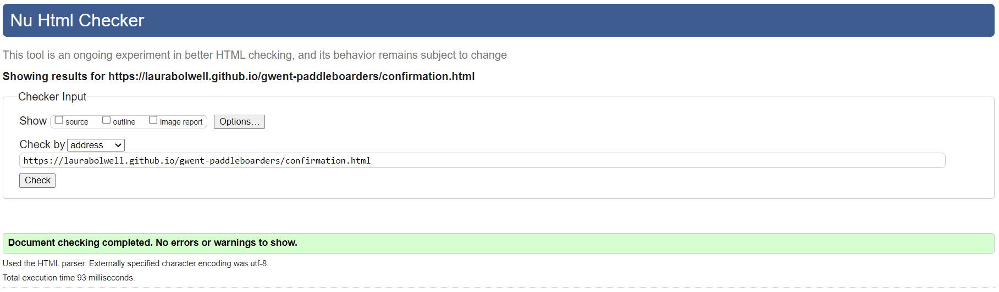 | Pass: No Errors |
| 404 | [W3C](https://validator.w3.org/nu/?doc=https%3A%2F%2Flaurabolwell.github.io%2Fgwent-paddleboarders%2F404.html) | 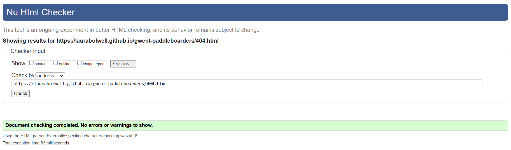 | Pass: No Errors |

### CSS

I have used the recommended [CSS Jigsaw Validator](https://jigsaw.w3.org/css-validator) to validate all of my CSS files.

| File | Jigsaw URL | Screenshot | Notes |
| --- | --- | --- | --- |
| style.css | [Jigsaw](https://jigsaw.w3.org/css-validator/validator?uri=https%3A%2F%2Flaurabolwell.github.io%2Fgwent-paddleboarders%2F&profile=css3svg&usermedium=all&warning=1&vextwarning=&lang=en) |  | Pass: All errors shown are from the imported Bootstrap library |

## Browser Compatibility

I've tested my deployed project on multiple browsers to check for compatibility issues.

| Browser | Screenshot | Notes |
| --- | --- | --- |
| Chrome | 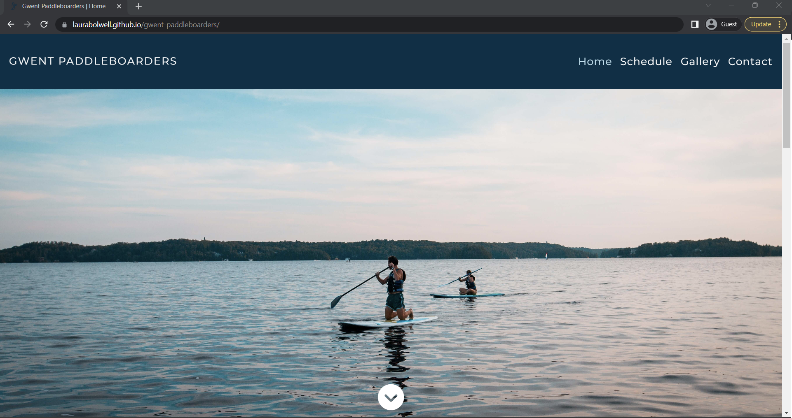 | Works as expected |
| Firefox |  | Works as expected |
| Edge |  | Works as expected |
| Safari |  | Minor CSS differences |
| Brave | 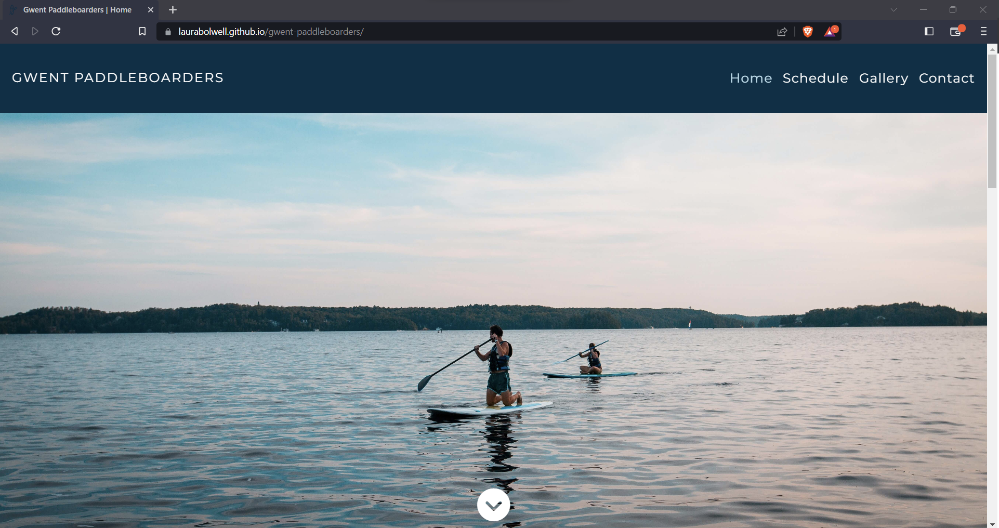 | Works as expected |
| Opera | 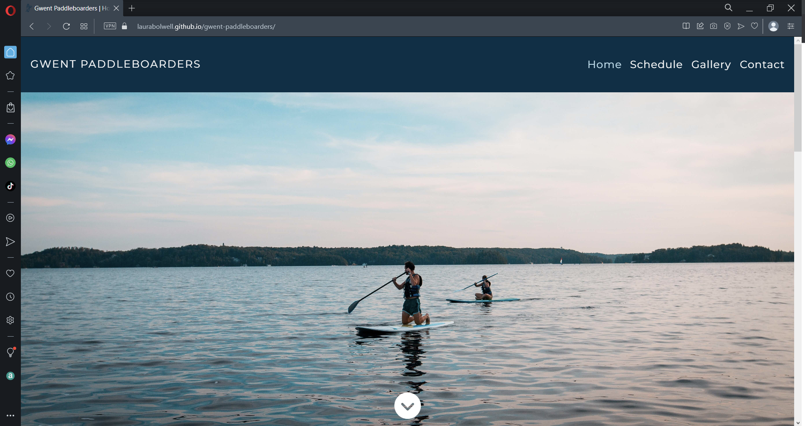 | Works as expected |
| Internet Explorer |  | Does not work as expected |

## Responsiveness

I've tested my deployed project on multiple devices to check for responsiveness issues.

| Device | Screenshot | Notes |
| --- | --- | --- |
| XS Mobile (DevTools) | 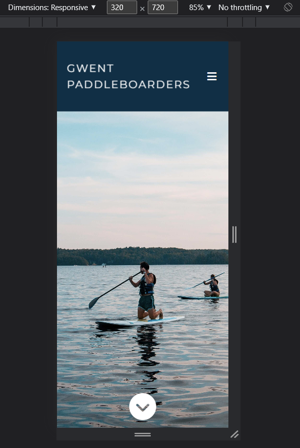 | Works as expected |
| Small Mobile (DevTools) | 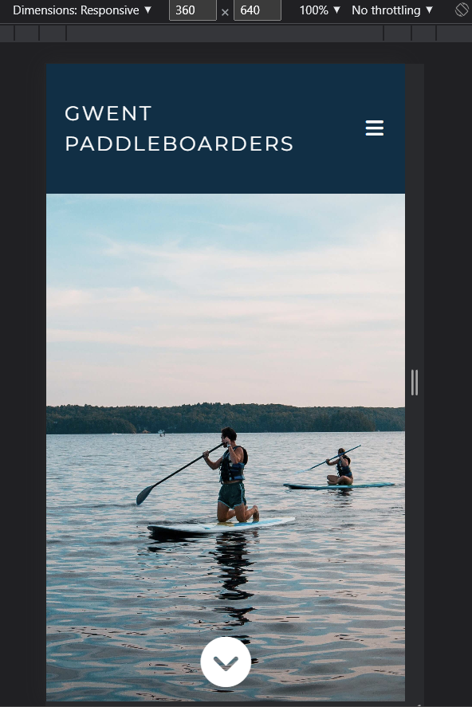 | Works as expected |
| Medium Mobile (DevTools) |  | Works as expected |
| Large Mobile (DevTools) | 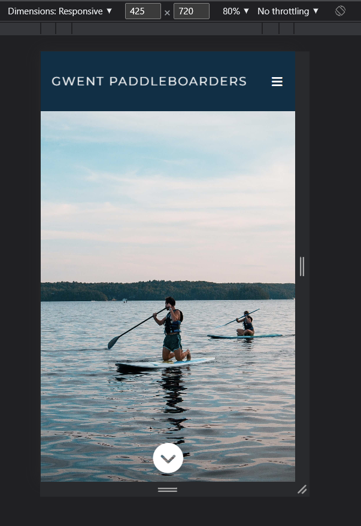 | Works as expected |
| Small Tablet (DevTools) | 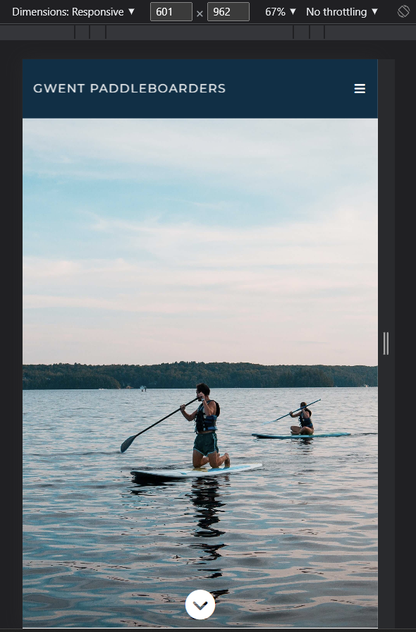 | Works as expected |
| Tablet (DevTools) |  | Works as expected |
| Laptop (DevTools) | 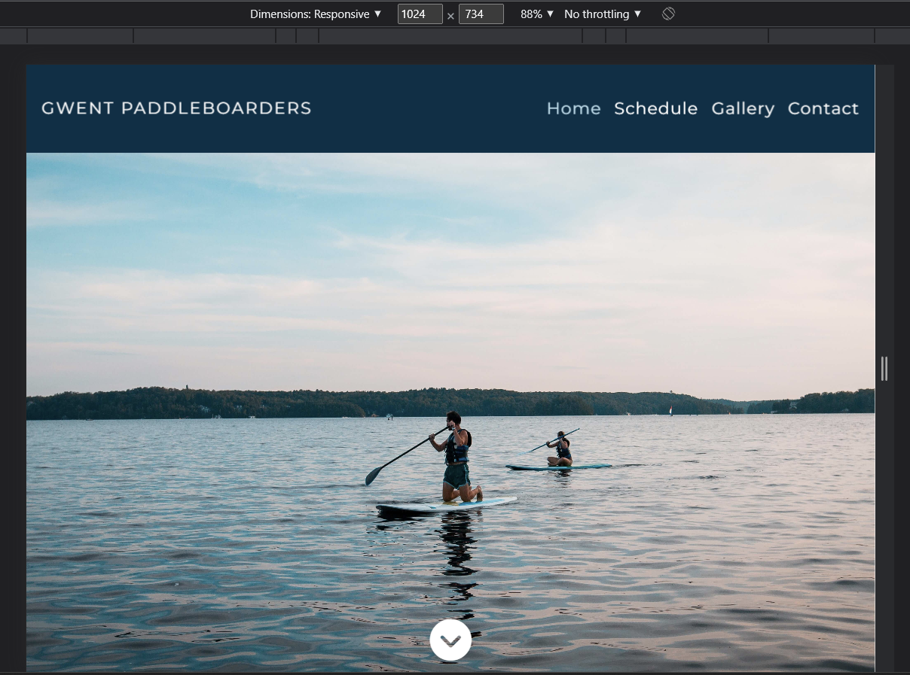 | Works as expected |
| Large Laptop (DevTools) |  | Works as expected |
| Desktop | 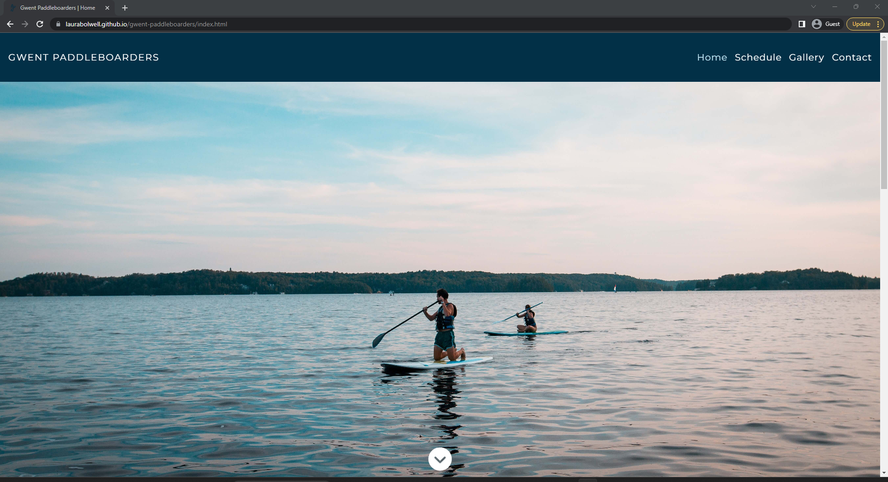 | Works as expected |
| XL Monitor (DevTools) |  | Scaling starts to have minor issues |
| 4K Monitor (DevTools) |  | Minor scaling issues |
| x | x | repeat for any other tested sizes |

## Lighthouse Audit

I've tested my deployed project using the Lighthouse Audit tool to check for any major issues.

| Page | Size | Screenshot | Notes |
| --- | --- | --- | --- |
| Home | Mobile | 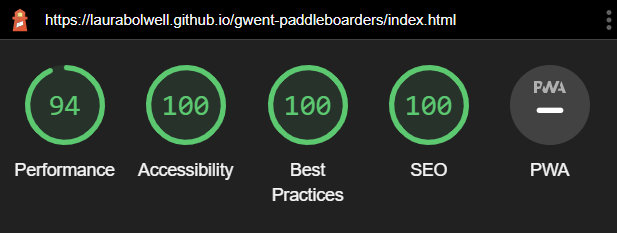 |  |
| Home | Desktop | 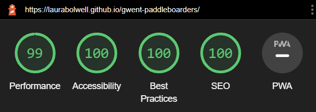 |  |
| Schedule | Mobile | 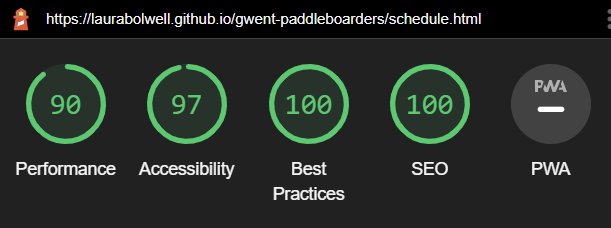 |  |
| Schedule | Desktop |  |  |
| Gallery | Mobile |  |  |
| Gallery | Desktop |  | |
| Contact | Mobile |  | |
| Contact | Desktop |  | |
| Confirmation | Mobile |  | |
| Confirmation | Desktop | 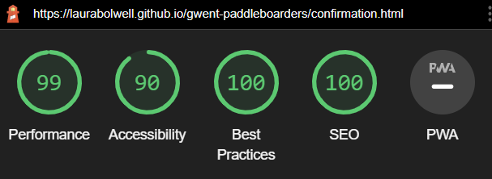 | |
| 404 | Mobile | 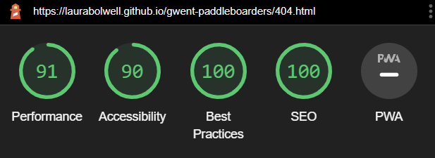 | |
| 404 | Desktop |  | |

## User Story Testing

| User Story | Screenshot | |
| --- | --- | ---|
| As a new site user, I would like to find out what the group is about, so that I can see if it would be suitable for me to join. | 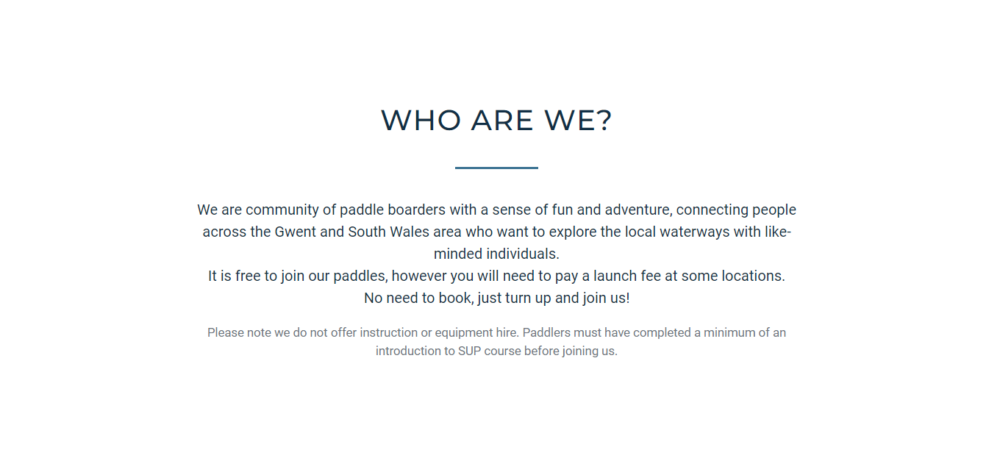 | |
| As a new site user, I would like to view photos of previous paddles, so that I can get a feel for if the group would be suitable for me. |  | |
| As a new site user, I would like to find out where and when the group meets, so that I can join the group. |  | 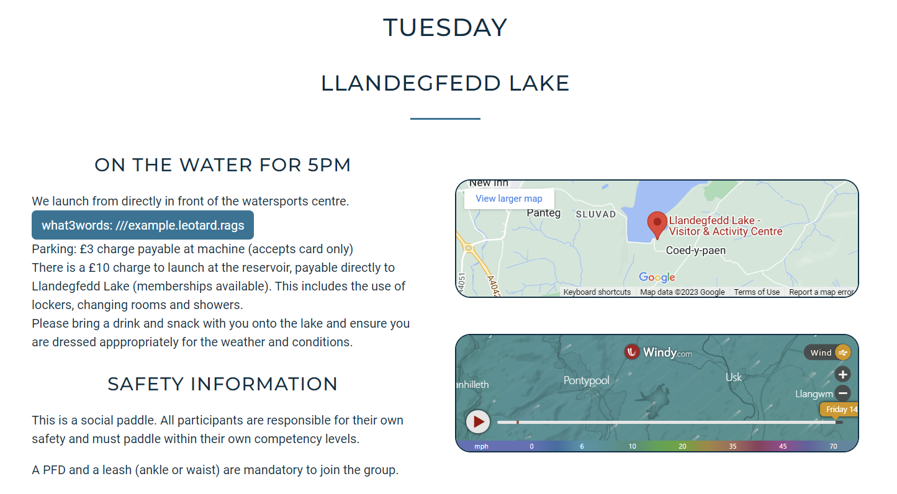 |
| As a new site user, I would like to find out how to join a group paddle and if there is any cost, so that I can join the group. |  | |
| As a new site user, I would like to find out about parking at paddle locations, so that I will know where to park my car when I join the group. |  | |
| As a new site user, I would like to contact the group organisers, so that I can ask any other questions I may have. | 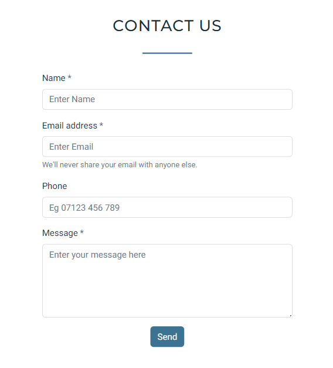 | |
| As a returning site user, I would like to find the schedule, so that I can check the times of group paddles. |  | 
| As a returning site user, I would like to check the weather conditions at paddle spots, so that I can decide whether to join a particular paddle. |  | |
| As a returning site user, I would like to view photogaphs of social paddles, so that I can show family and friends. |  | |
| As a returning site user, I would like to contact the group organisers, so that I can suggest new paddle locations. |  | |
| As a returning site user, I would like to easily find the group's social media pages, so that I can connect with other paddlers in the group. |  | |
| As a site administrator, I should be able to have all paddle information displayed, so that I can update all members and potential members on locations, times and other details eg parking costs. |  | |
| As a site administrator, I should be able to have images on the site, so that existing members can see photos of themselves from previous paddles and new members can see what our paddles are about. |  | |
| As a site administrator, I should be able to be contacted by both new and existing members, so that I can listen to any suggestions or answer any queries they may have. |  | |

## Bugs

⚠️⚠️⚠️⚠️⚠️ START OF NOTES (to be deleted) ⚠️⚠️⚠️⚠️⚠️

It's very important to document any bugs you've discovered while developing the project.
Make sure to include any necessary steps you've implemented to fix the bug(s) as well.

For JavaScript and Python applications, it's best to screenshot the errors to include them as well.

**PRO TIP**: screenshots of bugs are extremely helpful, and go a long way!

🛑🛑🛑🛑🛑 END OF NOTES (to be deleted) 🛑🛑🛑🛑🛑

- Navbar overflow issues

    Due to the long page name I had issues with the navbar content overflowing the page width. To overcome this I set the navbar to collapse when the screen size drops below 768px. I also had the issue of the navbar toggler icon dropping below the navbar brand on devices smaller than 420px. To fix this I added a line break between 'Gwent' and 'Paddleboarders' and used a media query so that the line break would only be visible on devices less than 420px.

- Python `'ModuleNotFoundError'` when trying to import module from imported package

    

    - To fix this, I _____________________.

- Django `TemplateDoesNotExist` at /appname/path appname/template_name.html

    

    - To fix this, I _____________________.

- Python `E501 line too long` (93 > 79 characters)

    

    - To fix this, I _____________________.

### GitHub **Issues**

⚠️⚠️⚠️⚠️⚠️ START OF NOTES (to be deleted) ⚠️⚠️⚠️⚠️⚠️

An improved way to manage bugs is to use the built-in **Issues** tracker on your GitHub repository.
To access your Issues, click on the "Issues" tab at the top of your repository.
Alternatively, use this link: https://github.com/laurabolwell/gwent-paddleboarders/issues

If using the Issues tracker for your bug management, you can simplify the documentation process.
Issues allow you to directly paste screenshots into the issue without having to first save the screenshot locally,
then uploading into your project.

You can add labels to your issues (`bug`), assign yourself as the owner, and add comments/updates as you progress with fixing the issue(s).

Once you've sorted the issue, you should then "Close" it.

When showcasing your bug tracking for assessment, you can use the following format:

🛑🛑🛑🛑🛑 END OF NOTES (to be deleted) 🛑🛑🛑🛑🛑

**Fixed Bugs**

All previously closed/fixed bugs can be tracked [here](https://github.com/laurabolwell/gwent-paddleboarders/issues?q=is%3Aissue+is%3Aclosed).

| Bug | Status |
| --- | --- |
| [JS Uncaught ReferenceError: `foobar` is undefined/not defined](https://github.com/laurabolwell/gwent-paddleboarders/issues/1) | Closed |
| [Python `'ModuleNotFoundError'` when trying to import module from imported package](https://github.com/laurabolwell/gwent-paddleboarders/issues/2) | Closed |
| [Django `TemplateDoesNotExist` at /appname/path appname/template_name.html](https://github.com/laurabolwell/gwent-paddleboarders/issues/3) | Closed |

**Open Issues**

Any remaining open issues can be tracked [here](https://github.com/laurabolwell/gwent-paddleboarders/issues).

| Bug | Status |
| --- | --- |
| [JS `'let'` or `'const'` or `'template literal syntax'` or `'arrow function syntax (=>)'` is available in ES6 (use `'esversion: 11'`) or Mozilla JS extensions (use moz).](https://github.com/laurabolwell/gwent-paddleboarders/issues/4) | Open |
| [Python `E501 line too long` (93 > 79 characters)](https://github.com/laurabolwell/gwent-paddleboarders/issues/5) | Open |

## Unfixed Bugs

⚠️⚠️⚠️⚠️⚠️ START OF NOTES (to be deleted) ⚠️⚠️⚠️⚠️⚠️

You will need to mention unfixed bugs and why they were not fixed.
This section should include shortcomings of the frameworks or technologies used.
Although time can be a big variable to consider, paucity of time and difficulty understanding
implementation is not a valid reason to leave bugs unfixed.

If you've identified any unfixed bugs, no matter how small, be sure to list them here.
It's better to be honest and list them, because if it's not documented and an assessor finds the issue,
they need to know whether or not you're aware of them as well, and why you've not corrected/fixed them.

Some examples:

🛑🛑🛑🛑🛑 END OF NOTES (to be deleted) 🛑🛑🛑🛑🛑

- On devices smaller than 375px, the page starts to have `overflow-x` scrolling.

    

    - Attempted fix: I tried to add additional media queries to handle this, but things started becoming too small to read.

- For PP3, when using a helper `clear()` function, any text above the height of the terminal does not clear, and remains when you scroll up.

    

    - Attempted fix: I tried to adjust the terminal size, but it only resizes the actual terminal, not the allowable area for text.

- When validating HTML with a semantic `section` element, the validator warns about lacking a header `h2-h6`. This is acceptable.

    

    - Attempted fix: this is a known warning and acceptable, and my section doesn't require a header since it's dynamically added via JS.

⚠️⚠️⚠️⚠️⚠️ START OF NOTES (to be deleted) ⚠️⚠️⚠️⚠️⚠️

If you legitimately cannot find any unfixed bugs or warnings, then use the following sentence:

🛑🛑🛑🛑🛑 END OF NOTES (to be deleted) 🛑🛑🛑🛑🛑

There are no remaining bugs that I am aware of.
 
built by: Tim Nelson